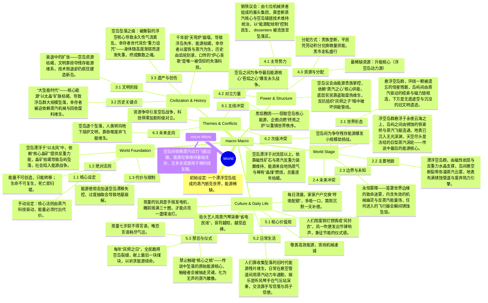

# World Mindmap

```mermaid
mindmap
  root((World))
    初始设定: 一个漂浮空岛组成的蒸汽朋克世界，能源稀缺。
    macro Macro
      空岛漂浮于对流层以上，依靠磁性矿石与蒸汽反重力装置维持，能源来自地热蒸气与稀有“晶煤”燃烧，总量逐年枯竭。
      1 世界基石 (World Foundation)
        空岛漂浮于“以太风”中，依赖“核心晶矿”提供反重力能，晶矿枯竭导致岛屿坠落，社会陷入能源战争。
        1.1 核心设定
          手动设定：核心法则由蒸汽科技驱动，能量必须付出代价。
        1.2 绝对法则
          能量不可创造，只能转移；生命不可复生，死亡即归墟。
        1.3 代价与限制
          能源使用会加速空岛漂移失控，过度抽取会导致地基崩解。
      2 空间与舞台 (World Stage)
        浮空岛群悬浮于永夜云海之上，岛屿之间由锈蚀的铁索桥与蒸汽飞艇连通，地表已沉入无光深渊，天空尽头是冻结的巨型蒸汽涡轮——传说中最后的能源核心。
        2.1 世界形态
          悬浮空岛群，环绕一颗被遗忘的恒星残骸，岛屿间由蒸汽驱动的缆索与磁力链相连，下方是无底虚空与沉没的旧文明遗迹。
        2.2 主要地貌
          漂浮空岛群，由磁性岩层与反重力水晶支撑，岛间悬空断裂带弥漫蒸汽云雾，地表布满锈蚀管道与废弃热力引擎。
        2.3 边界与未知
          永恒雾障——笼罩世界边缘的致命迷雾，内含失效的机械幽灵与反蒸汽能量场，任何进入的飞行器会瞬间锈蚀坠毁。
        2.4 未来冲突
      3 文明与历史 (Civilization & History)
        千年前“天穹炉”崩塌，导致浮岛失序、能源枯竭，幸存者以废铁与蒸汽为生，历史由齿轮刻录，口传的“炉心圣歌”是唯一被信仰的失落科技。
        3.1 文明阶段
          衰退中的扩张——空岛资源枯竭，文明靠掠夺残存能源维系，技术倒退却仍疯狂建造新岛。
        3.2 历史关键点
          “大坠能时代”——核心能源“以太晶”矿脉枯竭，导致浮岛群大规模坠落，幸存者被迫依赖蒸汽机械与回收废料维生。
        3.3 遗产与创伤
          空岛坠落之痕：被撕裂的浮空核心导致永久性气流紊乱，幸存者世代背负“重力诅咒”——身体随高度渐弱而逐渐失重，终成飘散之魂。
      4 权力与结构 (Power & Structure)
        空岛议会由能源贵族掌控，依赖“蒸汽之心”核心供能，底层贫民靠盗取废热维生，反抗组织“灰烬之子”暗中破坏供能管线。
        4.1 主导势力
          钢铁议会：由七位机械贤者组成的寡头集团，靠垄断蒸汽核心与空岛锚链技术维持统治，以“能源配给制”控制民生， dissenters 被流放至坠落区。
        4.2 对立力量
          黑焰教团——窃取空岛核心能源，企图点燃“终焉之炉”以重铸世界秩序。
        4.3 资源与分配
          最稀缺资源：升能核心（浮空岛动力源）
          分配方式：贵族垄断，平民凭劳动积分兑换微量供能，黑市走私盛行
      5 文化与日常 (Culture & Daily Life)
        人们用废铜烂铁铸成“风铃衣”，风一吹便发出节律响声，象征节能的仪式感。
        每日清晨，家家户户交换“呼吸配额”，多吸一口，需用沉默一天补偿。
        孩童的玩具是手摇发电机，睡前摇满三十圈，才能点亮一盏煤油灯。
        街头艺人用蒸汽琴演奏“省电民谣”，音符越短，越受追捧。
        5.1 核心价值观
          敬畏高效能源，崇尚机械虔诚
        5.2 日常生活
          人们靠收集坠落的旧时代能源残片维生，日常在悬空管道间用蒸汽动力车通勤，娱乐是听风琴手在气压站演奏，交流靠手写信笺与鸽子信使。
        5.3 禁忌与仪式
          禁止触碰“核心之核”——传说中坠落的原始能源核心，触碰者会被抽走灵魂，化为无声的蒸汽雕像。
          每年“灰烬之日”，全民跪拜空岛裂缝，献上最后一块煤块，以祈求能源续命。
          孩童七岁前不得言语，唯恐言语耗尽气运。
      6 主题与冲突 (Themes & Conflicts)
        资源争夺引发空岛战争，科技停滞加剧阶级对立。
        6.1 主线冲突
          空岛之间为争夺最后能源核心“苍焰之心”爆发永久战争。
        6.2 次级冲突
          空岛间为争夺残存能源爆发小规模劫掠战。
        6.3 未来走向
          空岛逐个坠落，人类转向地下熔炉文明，靠吞噬废弃飞艇维生。
    micro Micro
      空岛间依赖蒸汽动力飞艇运输，能源仅够维持基础生存，无多余资源用于微科技发展。
```
