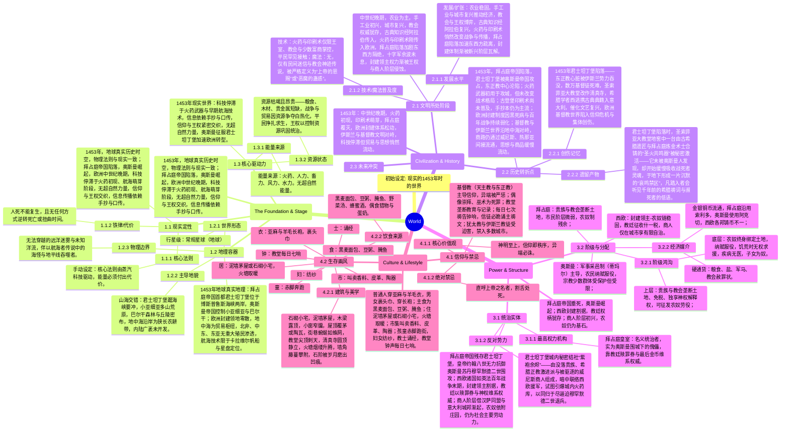

# World Mindmap

```mermaid
mindmap
  root((World))
    初始设定: 现实的1453年时的世界
    1 世界基石 (The Foundation & Stage)
      1453年，地球真实历史时空，物理法则与现实一致；拜占庭帝国陷落，奥斯曼崛起，欧洲中世纪晚期，科技停滞于火药初现、航海萌芽阶段，无超自然力量，信仰与王权交织，信息传播依赖手抄与口传。
      1.1 现实定性
        1453年，地球真实历史时空，物理法则与现实一致；拜占庭帝国陷落，奥斯曼崛起，欧洲中世纪晚期，科技停滞于火药初现、航海萌芽阶段，无超自然力量，信仰与王权交织，信息传播依赖手抄与口传。
        1.1.1 核心法则
          手动设定：核心法则由蒸汽科技驱动，能量必须付出代价。
        1.1.2 铁律/代价
          人死不能复生，且无任何方式逆转死亡或扭曲时间。
      1.2 地理容器
        1453年地球真实地理：拜占庭帝国首都君士坦丁堡位于博斯普鲁斯海峡两岸，奥斯曼帝国控制小亚细亚与巴尔干；欧洲封建领地零散，地中海为贸易枢纽，北非、中东、东亚无重大殖民渗透，航海技术限于卡拉维尔帆船与星盘定位。
        1.2.1 世界形态
          行星级：常规星球（地球）
        1.2.2 主导地貌
          山海交错：君士坦丁堡踞海峡要冲，小亚细亚多山荒原，巴尔干森林与丘陵密布，地中海沿岸为狭长农耕带，内陆广袤未开发。
        1.2.3 物理边界
          无法穿越的远洋迷雾与未知洋流，伴以航海者传说中的海怪与地平线吞噬者。
      1.3 核心驱动力
        1453年现实世界：科技停滞于火药武器与早期航海技术，信息依赖手抄与口传，信仰与王权紧密交织，无超自然力量，奥斯曼征服君士坦丁堡加速欧洲转型。
        1.3.1 能量来源
          能量来源：火药、人力、畜力、风力、水力。无超自然能量。
        1.3.2 资源状态
          资源枯竭且昂贵——粮食、木材、贵金属短缺，战争与贸易因资源争夺白热化，平民挣扎求生，王权以控制资源巩固统治。
    2 文明进程 (Civilization & History)
      1453年：中世纪晚期，火药初现，印刷术萌芽，拜占庭覆灭，欧洲封建体系松动，伊斯兰与基督教文明对峙，科技停滞但贸易与思想悄然流动。
      2.1 文明所处阶段
        中世纪晚期，农业为主，手工业初兴，城市复兴，教会权威犹存，古典知识经阿拉伯传入，火药与印刷术刚传入欧洲，拜占庭陷落加剧东西方隔绝，十字军余波未息，封建领主权力渐被王权与商人阶层侵蚀。
        2.1.1 发展水平
          发展/扩张：农业稳固，手工业与城市复兴推动经济，教会与王权博弈，古典知识经阿拉伯复兴，火药与印刷术悄然改变战争与传播，拜占庭陷落加速东西方疏离，封建体制渐被新兴阶层瓦解。
        2.1.2 技术/魔法普及度
          技术：火药与印刷术仅限王室、教会与少数富商掌控，平民罕见接触；魔法：无，仅有民间迷信与教会神迹传说，被严格定义为“上帝的恩赐”或“恶魔的蛊惑”。
      2.2 历史转折点
        1453年，拜占庭帝国陷落，君士坦丁堡被奥斯曼帝国攻占，东正教中心沦陷；火药武器初用于攻城，但未改变战术格局；古登堡印刷术尚未普及，手抄本仍为主流；欧洲封建制度因黑死病与百年战争持续弱化；基督教与伊斯兰世界沿地中海对峙，商路仍通过威尼斯、热那亚间接流通，思想与商品缓慢流动。
        2.2.1 创伤记忆
          1453年君士坦丁堡陷落——东正教心脏被伊斯兰势力吞没，数万基督徒死难，圣索菲亚大教堂改作清真寺，希腊学者西逃携古典典籍入意大利，催化文艺复兴，欧洲基督教世界陷入信仰危机与集体创伤。
        2.2.2 遗留产物
          君士坦丁堡陷落时，圣索菲亚大教堂地窖中一台由古希腊遗匠与拜占庭炼金术士合铸的“圣火共鸣器”被秘密激活——它未被奥斯曼人发现，却开始缓慢吸收战死者灵魂，于地下形成一片沉默的“哀鸣禁区”，凡踏入者会听见千年前的希腊祷词与濒死者的低语。
      2.3 未来冲突
    3 社会权力 (Power & Structure)
      拜占庭帝国垂死，奥斯曼崛起；西欧封建割据，教廷权柄犹存；商人阶层初兴，农奴仍为基石。
      3.1 统治实体
        拜占庭帝国残存君士坦丁堡，皇帝约翰八世无力抗御奥斯曼苏丹穆罕默德二世围攻；西欧诸国如英法百年战争末期，封建领主割据，教廷以赎罪券与神权维系权威；商人阶层借汉萨同盟与意大利城邦渐起，农奴依附庄园，仍为社会主要劳动力。
        3.1.1 最高权力机构
          拜占庭皇室：名义统治者，实为奥斯曼围城下的傀儡，靠教廷赎罪券与最后金币维系权威。
        3.1.2 反对势力
          君士坦丁堡城内秘密结社“紫袍余烬”——由没落贵族、希腊正教激进派与被驱逐的威尼斯商人组成，暗中联络西欧援军，试图引爆城内火药库，以同归于尽逼迫穆罕默德二世退兵。
      3.2 阶级与分配
        拜占庭：贵族与教会垄断土地，市民阶层微弱，农奴制残余；
        奥斯曼：军事采邑制（蒂玛尔）主导，农民纳赋服役，宗教少数群体受保护但受限；
        西欧：封建领主-农奴链稳固，教廷征收什一税，商人仅在城市享有限自治。
        3.2.1 阶级鸿沟
          上层：贵族与教会垄断土地、免税、独享神权解释权，可征发农奴劳役；
          底层：农奴终身绑定土地，纳赋服役，饥荒时无权求援，疾病无医，子女为奴。
        3.2.2 经济媒介
          金银铜币流通，拜占庭沿用索利多，奥斯曼使用阿克切，西欧各邦铸币不一；
          硬通货：粮食、盐、军马、教会赦罪状。
    4 人文生态 (Culture & Lifestyle)
      普通人穿亚麻与羊毛衣，男女裹头巾、穿长袍；主食为黑麦面包、豆粥、腌鱼；住泥墙茅屋或石砌小宅，火塘取暖；市集叫卖香料、皮革、陶器；孩童赤脚跑街，妇女纺纱，教士诵经，教堂钟声每日七响。
      4.1 信仰与禁忌
        基督教（天主教与东正教）主导信仰，异端被严惩；偶像崇拜、巫术为死罪；教堂垄断教育与记录；每日七次祷告钟响，信徒必跪诵主祷文；犹太教与伊斯兰教徒受迫害，禁入多数城市。
        4.1.1 核心价值观
          神明至上，信仰即秩序，异端必诛。
        4.1.2 绝对禁忌
          直呼上帝之名者，割舌处死。
      4.2 生存画风
        衣：亚麻与羊毛长袍，裹头巾
        食：黑麦面包、豆粥、腌鱼
        居：泥墙茅屋或石砌小宅，火塘取暖
        市：叫卖香料、皮革、陶器
        童：赤脚奔跑
        妇：纺纱
        士：诵经
        钟：教堂每日七响
        4.2.1 建筑与美学
          石砌小宅，泥墙茅屋，木梁露顶，小窗窄牖，屋顶覆茅或陶瓦，街巷蜿蜒如蛛网，教堂尖顶刺天，清真寺圆顶静立，火塘烟缕升腾，墙角藤蔓攀附，石阶被岁月磨出凹痕。
        4.2.2 饮食来源
          黑麦面包、豆粥、腌鱼、野菜汤、蜂蜜酒，偶食猎物与蛋奶。
```
